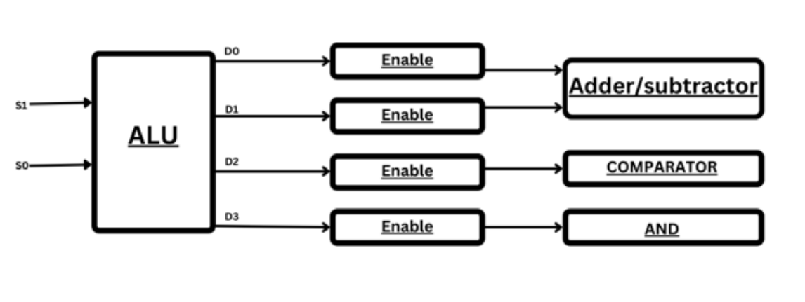

# 4-Bit ALU

This is a repository for my 4 bit Arithematic Logic unit that I had built in the summer of 2024. 
### Introduction to ALU Structure and Input-Output Relations

The Arithmetic Logic Unit (ALU) is a critical component of the CPU that performs arithmetic and logic operations. The diagram below illustrates the structure of an ALU with various functional blocks connected to it. Here, we break down the structure and explain the input-output relationships.

#### ALU Structure

1. **Inputs:**
   - **S1 and S0:** These are the selection lines that determine the operation to be performed by the ALU.
   - **D0, D1, D2, D3:** These are the outputs from the ALU that feed into different functional blocks via enable lines.

2. **Functional Blocks:**
   - **Adder/Subtractor:** This block performs addition or subtraction operations based on the enable signal it receives.
   - **Comparator:** This block compares the input values and determines the relational condition (e.g., equal, greater than, less than).
   - **AND:** This block performs the logical AND operation on the input values.

#### Input-Output Relations

- **Selection Lines (S1, S0):** These lines control which operation the ALU will perform and which functional block will be enabled.
- **Enable Lines:** Each enable line controls whether its respective functional block is activated.
  - **Enable Line for Adder/Subtractor:** When activated, the Adder/Subtractor performs the required arithmetic operation.
  - **Enable Line for Comparator:** When activated, the Comparator checks the relational condition between inputs.
  - **Enable Line for AND:** When activated, the AND block performs the logical AND operation.

#### Operation Flow

1. **Selection:**
   - The values of S1 and S0 determine which operation is to be executed by the ALU.

2. **Enabling Functional Blocks:**
   - Based on the selection, one of the enable lines (D0, D1, D2, D3) is activated.
   - The activated enable line triggers the corresponding functional block.

3. **Execution:**
   - The enabled functional block performs its designated operation (arithmetic, comparison, or logical AND).

This structured approach allows the ALU to perform multiple types of operations by directing inputs through the appropriate functional blocks, thus ensuring efficient processing within the CPU.

### Project Workflow

The project workflow involves several stages, each crucial to the overall design and analysis process. Below is a detailed description of each step.

#### 1. Designing the Blocks on Verilog
The first step involves designing the basic blocks using Verilog. This includes defining the structure and behavior of the digital circuits.

#### 2. Setting Up Verilog Test Bench
After designing the blocks, a Verilog test bench is set up to simulate and verify the functionality of the designs.

#### 3. Designing the Gates on MAGIC
Next, the gates are designed using the MAGIC VLSI layout tool. This step translates the digital design into a physical layout.

#### 4. Exporting the SPICE File and Checking Functionality
The designed gates are exported to a SPICE file. This file is then used to check the functionality of the individual components through simulations.

#### 5. Assembling the Individual Components
The individual components, once verified, are assembled to form the complete circuit.

#### 6. Exporting the SPICE Files
The SPICE files for the assembled components are exported for further analysis.

#### 7. Delays in Individual Components
The delays in the individual components are analyzed to identify any potential timing issues.

#### 8. Maximum Delay Analysis
Finally, a maximum delay analysis is performed to ensure that the overall design meets the required timing constraints.

### Visual Workflow

## Final Design 

